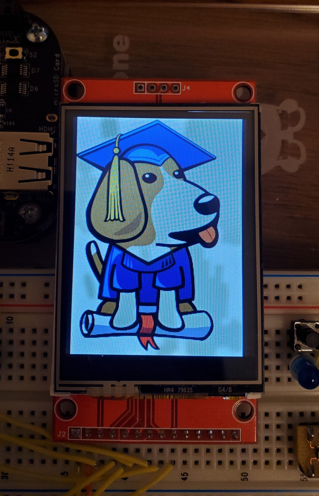
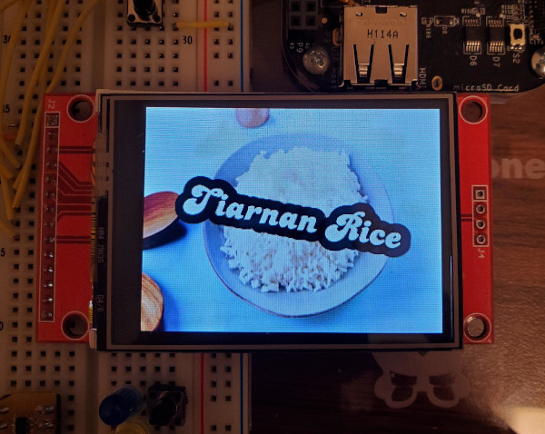

# Homework 4

## Memory Map

| Block Name  | Start Address | End Address |
|-------------|---------------|-------------|
| GPMC        | 0x00000000    | 0x1FFFFFFF  |
| EMIF0 SDRAM | 0x80000000    | 0xBFFFFFFF  |
| GPIO0       | 0x44E07000    | 0x44E07FFF  |
| UART0       | 0x44E09000    | 0x44E09FFF  |
| I2C0        | 0x44E0B000    | 0x44E0BFFF  |
| UART1       | 0x48022000    | 0x48022FFF  |
| UART2       | 0x48024000    | 0x48024FFF  |
| I2C1        | 0x4802A000    | 0x4802AFFF  |
| McSPI0      | 0x48030000    | 0x48030FFF  |
| GPIO1       | 0x4804C000    | 0x4804CFFF  |
| I2C2        | 0x4819C000    | 0x4809CFFF  |
| McSPI1      | 0x481A1000    | 0x481A1FFF  |
| UART3       | 0x481A6000    | 0x481A6FFF  |
| UART4       | 0x481A8000    | 0x481A8FFF  |
| UART5       | 0x481AA000    | 0x481AAFFF  |
| GPIO2       | 0x481AC000    | 0x481ACFFF  |
| GPIO3       | 0x481AE000    | 0x481AEFFF  |

## GPIO via mmap

pymmap.py reads buttons on P9_22 and PX_XX and toggles the USR3 and USR2 LEDs, all using mmap. One button is on GPIO0 and one is on GPIO1, necessitating two mmap calls. Run with `sudo ./pymmap.py`.

pymmaptoggle.py toggles P8_12 as fast as possible using mmap. Run with `sudo ./pymmaptoggle.py`.
The toggle period using this method is about 11.9uS, which is in between GPIOD using C (3.4uS) and GPIOD using python (18uS).

## i2c via the kernel driver

kerneltemp.sh enables the kernel driver for the tmp101, reads the temperature, and then prints it to the console. Run with `sudo ./kerneltemp.sh`.

## Control the LED matrix from the browser

etchasketch_web.py runs a flask web server that displays buttons to control the LED matrix etch-a-sketch. It has up, down, left, and right to move the cursor and draw, clear to clear the display, and green, red, and yellow buttons to change the cursor color. Run with `sudo ./etchasketch_web.py`. It needs sudo so that i2c will function. 

## TFT display

The below image was generated with name.sh. Run with `sudo ./name.sh`.

