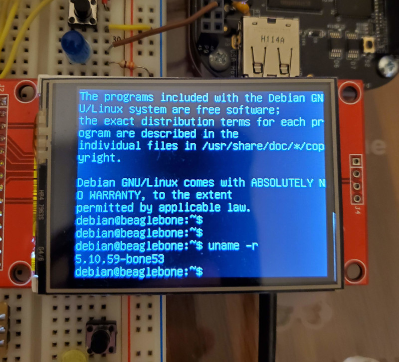

# HOMEWORK 5

## Make

make/Makefile

## Installing the Kernel Source

I ran build_deb.sh in the kernel source repository with the 5.10.59-bone53 version of the kernel. Running `uname -r` on the bone shows the new kernel loaded and running:

## Kernel Modules

## ADXL345

etchasketch_accel.py is an etch-a-sketch program that uses the LED matrix as a display and the accelerometer to control it. It uses the kernel driver to interface with the ADXL345. If an instance of the device doesn't exist, the script will automatically create it. Tilting the beaglebone in X or Y will cause the cursor to move in that direction two pixels per second, drawing as it moves. Shaking the bone will erase the screen, just like a normal etch-a-sketch, and flipping it upsidedown will cycle to the next color. Run with `sudo ./etchasketch_accel.py`.

# hw05 grading

| Points      | Description |
| ----------- | ----------- |
|  0/0 | Project 
|  2/2 | Makefile
|  6/6 | Kernel Source
|  4/4 | Etch-a-Sketch
|  8/8 | Kernel Modules: hello, ebbchar, gpio_test, led
|  4/4 | Extras - Blink at different rates
| 24/20 | **Total**

*My comments are in italics. --may*

*Nicely done etch-a-sketch!*