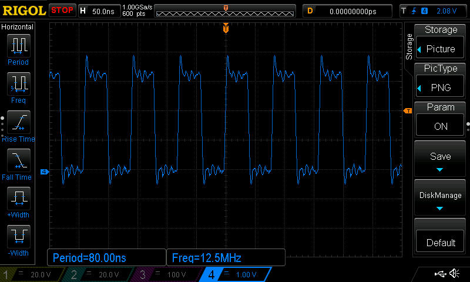
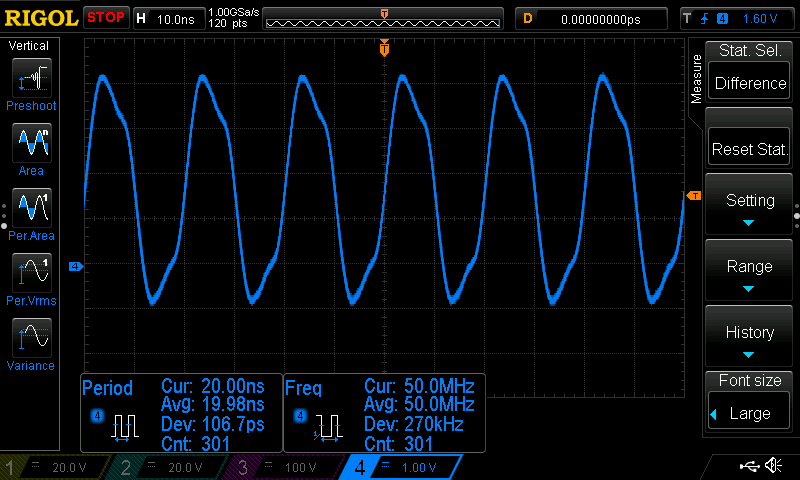
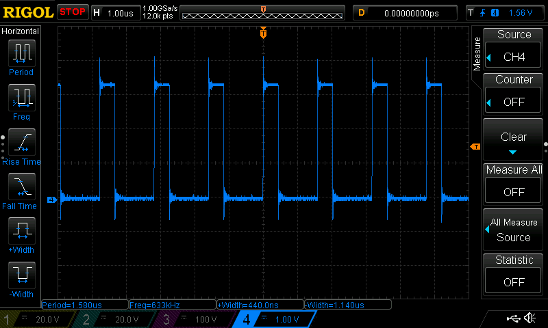
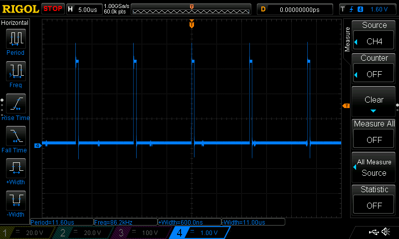
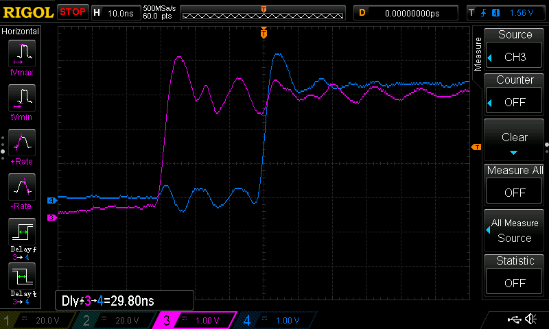
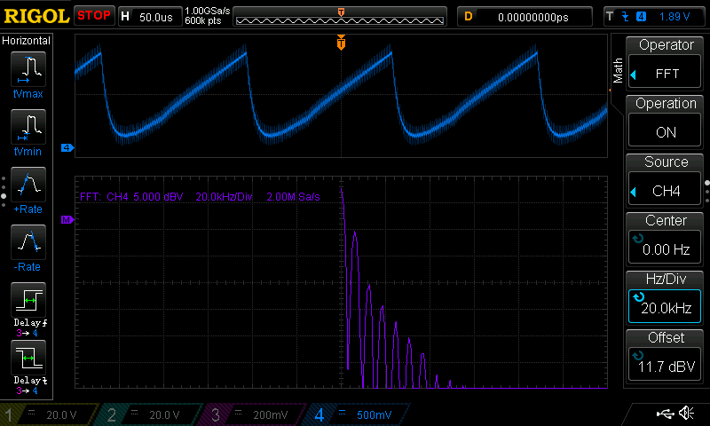
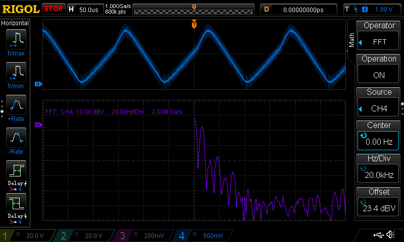
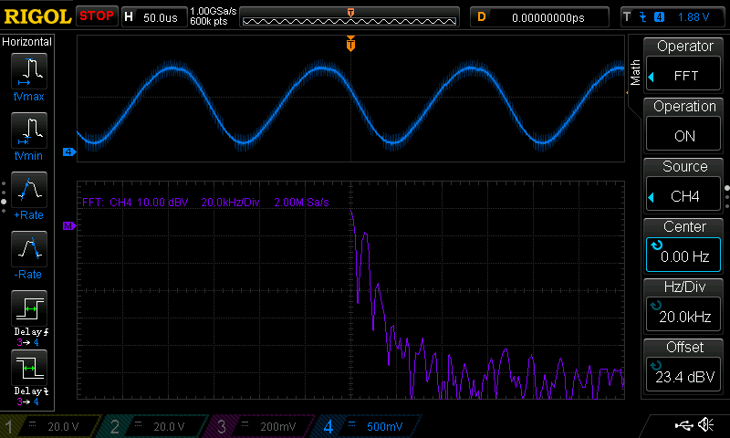

# Homework 8

## Blinking an LED

hello.pru0.c turns pin 9_31 on and off as fast as possible using the ARM gpio registers. Run with `sudo make TARGET=hello.pru0`, and stop with `sudo make TARGET=hello.pru0 stop`.
Below is a scope capture of P9_31 toggling as fast as it can using this method. The fastest that it can toggle is 12.5MHz, and there is a substantial amount of jitter.

*Maximum frequency toggling with ARM*

## PWM Generator

pwm1.pru0.c toggles P9_31 using the PRU inside the Beaglebone. With no delays the fastest I could make it toggle was about 67MHz. I made the signal symmetric by setting a delay of 1 cycle after turning the pin on, since setting the program counter back to the beginning of the loop after turning the pin off uses 1 clock cycle. With this delay the frequency is 50MHz as shown below. Run with `sudo make TARGET=pwm1.pru0`, and be sure to set the pin to a pru output with `config-pin p9.31 pruout`. The waveform is perfectly stable with no jitter, which is apparent from the ~100ps standard deviation in the period.

*Maximum symmetric frequency toggling with PRU*

## Controlling the PWM Frequency

pwm4.pru0.c PWMs pins 9_28 9_29 9_30 and 9_31 using the PRU all at the same time. The maximum frequency I could get on any one pin using this program was 633kHz, and this was by setting the number of on cycles and off cycles to one for every channel. 

*Maximum frequency using pwm4*

When I run pwm-test.c, the output for p9_31 is:

*On and off times changed by pwm-test.c*

## Reading an Input at Regular Intervals

input.pru0.c reads the state of an input pin and puts it on an output pin. run-input.sh configures the pins and builds the program. Run with `sudo ./runinput.sh`. The delay between when the input goes high to when the output goes high is about 30ns. 

*PRU in-out delay, pink is input and blue is output*

## Analog Wave Generator

Here I ran sine.pru0.c which uses PWM modulated by different shaped signals, which are then input into an RC low pass filter to recreate the original signal. My RC filter was four 100nF capacitors in series with a 10k potentiometer for tuning. The code is run with `sudo make TARGET=sine.pru0.c`, and the signal type can be changed by uncommenting the #define at the beginning of the file. For each waveform, I tuned the resistance to get rid of as much of the high frequency content as possible while still leaving a relatively sharp corner for the sawtooth and triangle waves and keeping the magnitude as high as possible for the sine wave. This is difficult to do with the RC filter because it is only a first order filter with a slow roll off. A higher order filter would be better to limit the output to just the necessary harmonics to recreate the signal accurately. 

*Sawtooth*

# hw08 grading

| Points      | Description |
| ----------- | ----------- |
| 14/14 | PRU
|  2/2 | Controlling the PWM Frequency - optional
|  2/2 | Reading an Input at Regular Intervals - optional
|  2/2 | Analog Wave Generator - optional
| 20/20 | **Total**

*My comments are in italics. --may*
